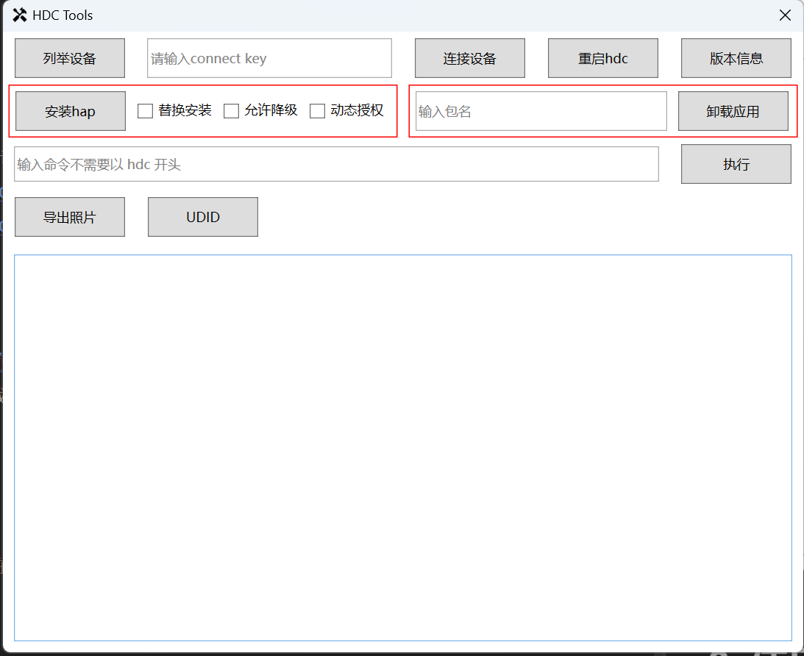
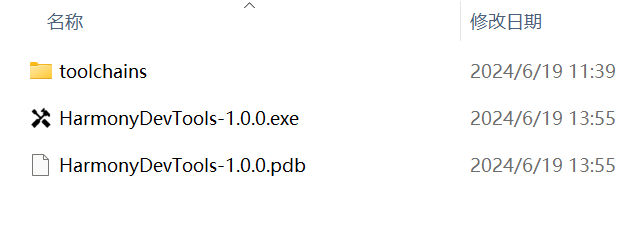

本项目为HarmonyOS/OpenHarmony的 toolchains 工具提供UI操作, 方便使用.

## 1. 版本说明

目前支持 hdc 工具的使用,后续会陆续增加其他工具~

## 2. 使用方式

下载最新的 Release包, 解压如下目录, 双击 `HarmonyDevTools.exe` 运行。

运行环境要求: netcore6.0, 如果双击无法运行，请下载安装 netcore6.0 runtime: 
- x64版本：https://dotnet.microsoft.com/en-us/download/dotnet/thank-you/runtime-desktop-6.0.31-windows-x64-installer
- x86版本：https://dotnet.microsoft.com/en-us/download/dotnet/thank-you/runtime-desktop-6.0.31-windows-x86-installer

## 3. 更新hdc

根据OpenHarmony官方的文档: [hdc使用指导](https://docs.openharmony.cn/pages/v4.1/zh-cn/device-dev/subsystems/subsys-toolchain-hdc-guide.md),
安装DevEco以后, 设置SDK路径, 下载最新的SDK, 里面包含 toolchains

> ## 环境准备
> hdc 工具获取方式：
>
> 通过OpenHarmony sdk获取，hdc在sdk的toolchains目录下。
>
> **使用举例：**
>
> 下面以windows侧使用方式举例：
>
> 获取windows的sdk，将hdc.exe放到磁盘某个位置即可使用。

